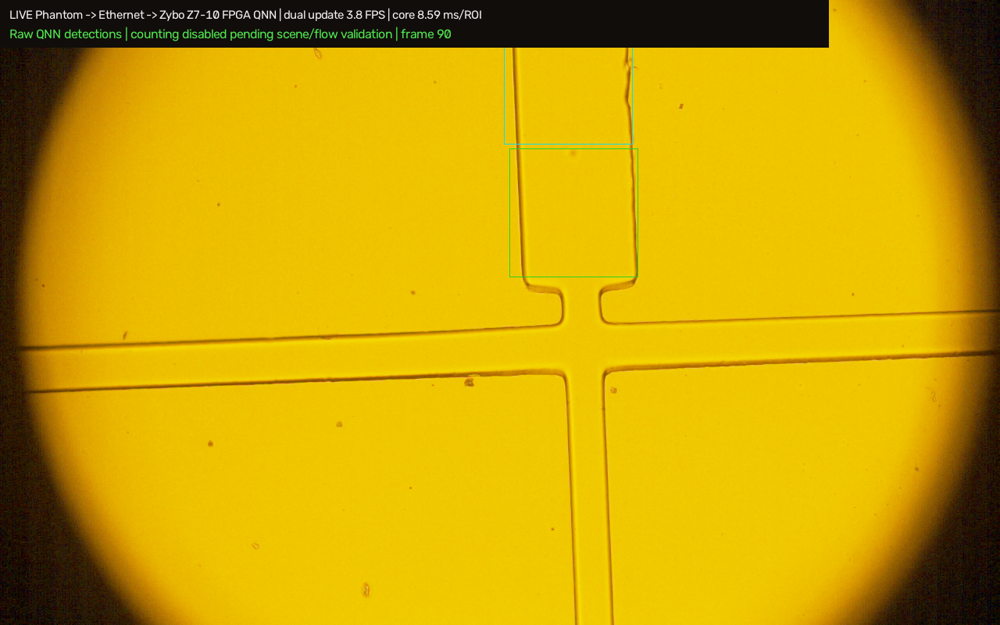
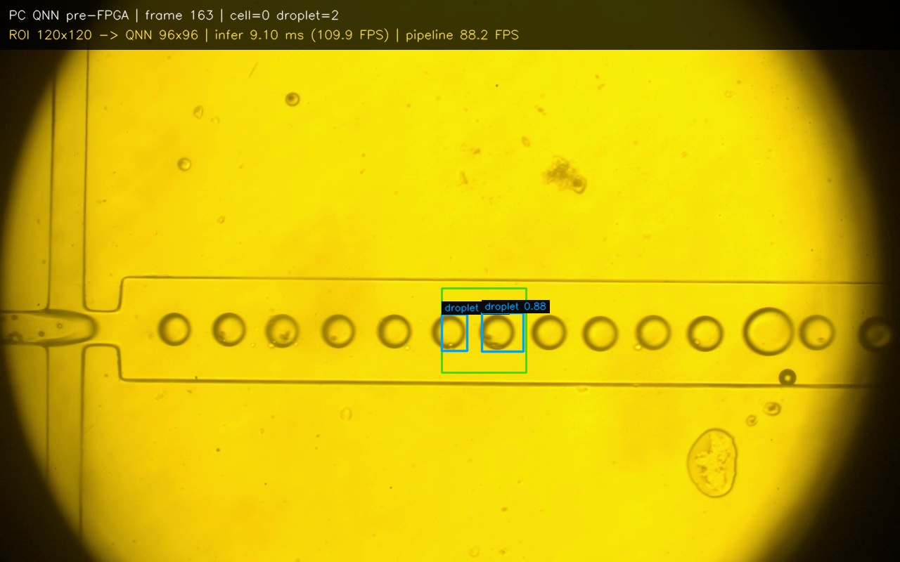

# Phantom VEO 710L + Zybo Z7-10 QNN Deployment

This document records the reproducible live path for the 15 um cell/droplet
experiment. The repository contains source code and configuration only. Large
camera recordings, SDK installers, model weights and generated videos stay
local and are intentionally excluded from Git.

## 1. System

```text
Phantom VEO 710L
  -> 1 Gb Ethernet switch
  -> PC + Phantom SDK/native acquisition
  -> crop to two ROIs and rotate each ROI
  -> UDP Ethernet, Zybo Z7-10 PS
  -> AXI/DMA stream to QNN accelerator in PL
  -> UDP detections back to PC
  -> box overlay and ROI-1 candidate / ROI-2 confirmation
```

| Component | Value |
|---|---|
| Camera | Phantom VEO 710L, serial `25225` |
| Camera IP | `100.100.196.217` |
| Camera configured frame | `1280 x 800` |
| PC Ethernet | `100.100.100.1/16` |
| Zybo Z7-10 | `100.100.100.2`, UDP port `50123` |
| FPGA part | Xilinx Zynq XC7Z010-1CLG400C |
| QNN manifest | `exports/15micro_qnn_w4a6_96_roi120_v1/fpga_manifest_raw_core.json` |
| QNN input | 96 x 96 ROI, W4/A6 FPGA stream |
| Live reader | Phantom native SDK, fast demosaic, SDK crop |

## 2. ROI and counting

The two ROIs are kept in the camera's native coordinate system:

```text
ROI 1 / candidate: x=652, y=190, w=164, h=164
ROI 2 / confirm:   x=645, y=20,  w=164, h=164
flow: bottom_to_top
rotation sent to the model: 270 degrees CCW (clockwise image rotation)
```

ROI 1 creates a track candidate. The same object is associated with ROI 2 by
class, order, timing and cross-axis distance; ROI 2 confirms the existing ID.
The two ROI observations are therefore not added as two objects. Counting is
disabled in the checked-in default until the physical flow calibration is
validated with a known sequence. Enable it only after that validation with
`--enable-counting`.

The active live configuration is
`configs/phantom_live_dual_roi_20260910.json`. Change ROI geometry there rather
than editing code.

## 3. Launching on Windows

Use a 1 Gb Ethernet link between camera, PC and Zybo. USB is power/JTAG only;
it is not the image transport path.

Full-frame camera preview, with SDK crop explicitly disabled:

```powershell
powershell -ExecutionPolicy Bypass -File scripts\start_phantom_full_frame.ps1
```

Live QNN detection with two ROIs:

```powershell
powershell -ExecutionPolicy Bypass -File scripts\start_phantom_qnn_ethernet.ps1
```

The launchers prevent duplicate sessions and write the latest session path to
`final_results/phantom_camera_qnn_live/latest_session.txt`. Press `Esc` in the
OpenCV window to stop. Session reports and optional annotated frames are saved
under `final_results/phantom_camera_qnn_live/`.

Direct headless camera-to-FPGA benchmark with saved annotated frames:

```powershell
.venv-phantom64\Scripts\python.exe scripts\run_phantom_zybo_qnn_live.py `
  --duration-sec 20 --headless --save-frames `
  --reader native-crop-fast `
  --output reports\phantom_live_benchmark
```

Offline UDP replay benchmark:

```powershell
.venv-phantom64\Scripts\python.exe scripts\benchmark_zybo_qnn_udp.py `
  --video "C:\path\to\video.mp4" --frames 120 --save-frames `
  --output reports\zybo_udp_benchmark
```

Optional Realtek adapter tuning can disable energy-saving features. It requires
an elevated PowerShell and affects only the selected Ethernet adapter:

```powershell
powershell -ExecutionPolicy Bypass -File scripts\tune_phantom_ethernet_adapter.ps1 -Mode apply
# restore after testing
powershell -ExecutionPolicy Bypass -File scripts\tune_phantom_ethernet_adapter.ps1 -Mode restore
```

Keep Jumbo Frames disabled unless every device in the path supports the same
MTU. The UDP protocol and FPGA firmware currently use the normal Ethernet MTU.

## 4. Measured results

## 4a. Visual evidence

The following figures are checked-in examples from the measured pipeline.

**Full-frame camera input before detection:**


**Live Zybo QNN output with two ROI windows:** the green and cyan regions are
the candidate and confirmation ROIs; the blue boxes are QNN detections returned
through the Ethernet path.



**ROI120 QNN pre-FPGA reference:** this figure shows the smaller ROI detector
and its measured inference/pipeline timing before the same model is sent
through the Zybo stream.



These are measurements from the connected hardware and current software, not a
claim that every camera mode reaches the same rate.

| Test | Result |
|---|---:|
| Full-frame SDK acquisition, original demosaic | about 10--14 fps |
| Full-frame native fast demosaic | about 19.25 fps |
| Live camera + SDK crop + dual QNN + overlay | **27.06 fps end-to-end** |
| Live camera capture portion in that run | 27.49 fps |
| QNN inference per ROI | 8.586 ms |
| UDP round trip per ROI | 9.540 ms |
| Offline video 3.4, FPGA UDP, export included | 23.67 fps |
| Offline video 3.5, FPGA UDP, export included | 24.56 fps |

The live benchmark processed 542 camera frames in 20.031 s, with 1,084 ROI
inferences. The full report is in the local benchmark session output. Offline
export includes image annotation and video/image writing; it is not the raw
accelerator rate.

The camera's high-speed recording mode stores frames internally and can record
at a much higher nominal frame rate. That does not mean the complete live
Ethernet path can transmit and display the same rate. The current unit is
observed on a 1 Gb Ethernet path; consult the camera's official interface
options before planning a faster transport.

## 5. Troubleshooting

1. No camera: confirm the camera is powered, the PC and camera are on the same
   switch, and the Phantom SDK can discover serial `25225`.
2. No FPGA response: ping `100.100.100.2`, confirm the Zybo firmware listens on
   UDP `50123`, and verify the PC Ethernet address is `100.100.100.1/16`.
3. Wrong framing: use the full-frame launcher first. It resets crop and
   resampling selectors before acquisition.
4. Low live FPS: use `native-crop-fast`, avoid MP4 recording during measurement,
   save frames only for a benchmark, and keep the display rate separate from
   acquisition rate.
5. Wrong boxes: verify the two native-coordinate ROIs and the 270-degree ROI
   rotation in the JSON configuration before changing model thresholds.

## 6. Repository boundaries

Tracked files contain the implementation, protocol, configuration, tests and
documentation needed to reproduce the deployment. Local-only artifacts are
ignored: SDK installers, Python environments, videos, image dumps, PyTorch
weights and generated benchmark directories. Keep those in the local workspace
or external storage and record their paths in the session report.
