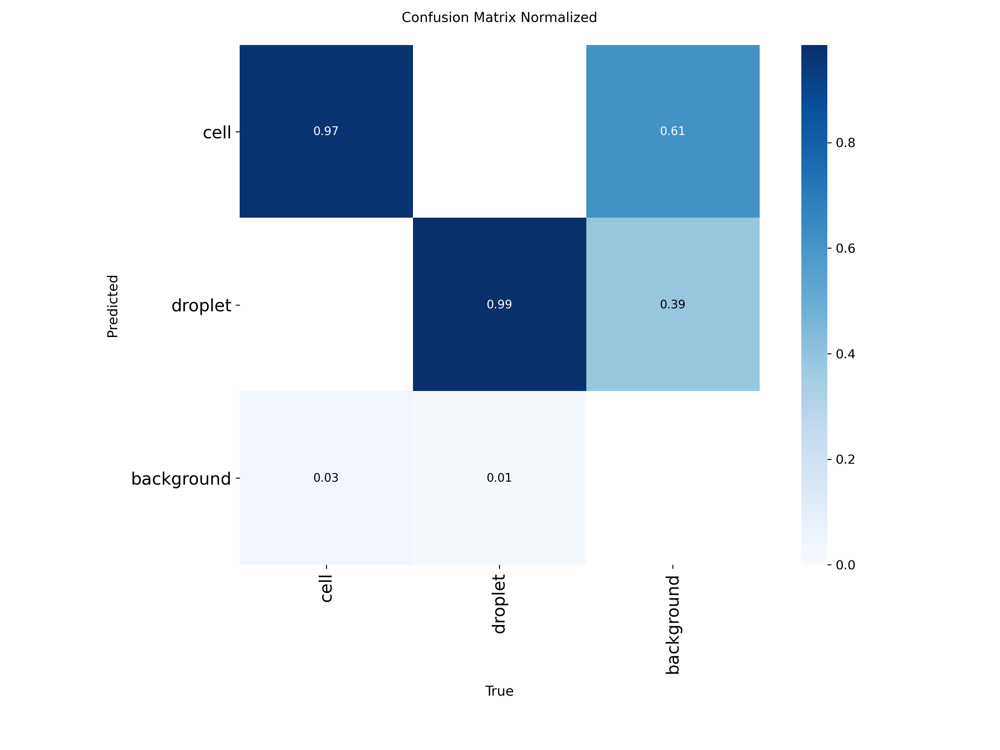
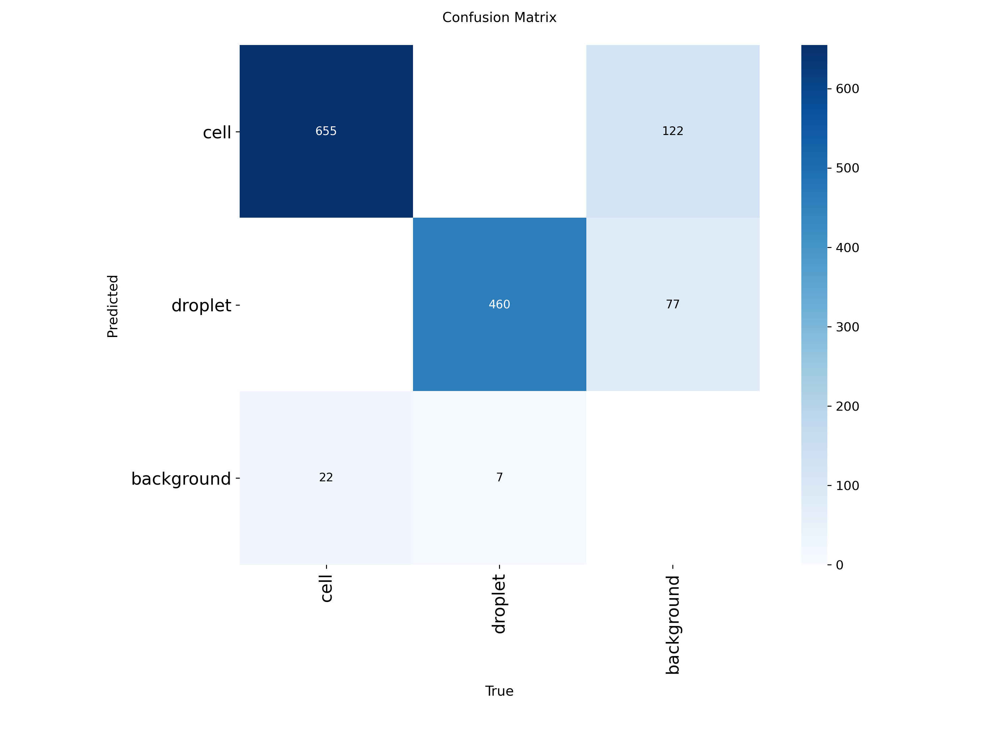

# Cell and droplet detection on Arty S7-25

## Phantom VEO 710L + Zybo Z7-10

The current Ethernet live pipeline is documented in
[DEPLOYMENT_PHANTOM_ZYBO_QNN.md](DEPLOYMENT_PHANTOM_ZYBO_QNN.md). It covers the
Phantom VEO 710L acquisition path, the two-stage QNN ROI detector on the Zybo
Z7-10, measured throughput, launch commands, and troubleshooting.

### Hinh minh hoa ket qua

Anh full-frame tu camera Phantom truoc khi cat ROI:


Ket qua QNN hai ROI chay qua Ethernet tren Zybo Z7-10. ROI 1 tao candidate,
ROI 2 xac nhan cung object; hai ROI khong duoc cong thanh hai vat the:


Ket qua QNN ROI120 lam moc truoc khi dua model vao FPGA:


### So do pipeline thuat toan

```mermaid
flowchart LR
    A[Phantom VEO 710L] --> B[Ethernet switch]
    B --> C[PC Phantom SDK\nfull frame 1280x800]
    C --> D[Crop hai ROI\nrotate + resize 96x96]
    D --> E[UDP Ethernet]
    E --> F[Zybo Z7-10\nPS + DMA]
    F --> G[QNN W4A6 trong FPGA PL]
    G --> H[Detections + confidence]
    H --> I[ROI 1 candidate]
    I --> J[ROI 2 confirm\ntrack va dem]
    J --> K[Overlay + report FPS]
```



### Confusion matrix

Confusion matrix duoi day la ket qua test cua YOLO11n FP32 tren PC, duoc dung
lam teacher/baseline truoc khi luong tu hoa. Day khong phai la confusion matrix
cua QNN FPGA; ket qua QNN FPGA duoc danh gia them bang frame metrics va report
trong cac thu muc benchmark.





Du an gom ba moc co vai tro khac nhau:

1. `YOLO11n FP32` tren PC de lam moc do chinh xac.
2. `TinyQuantDetector W4A8` lam moc QNN uu tien do chinh xac.
3. `TinyQuantDetector W4A4 raw-head` lam ung vien phan cung tren FPGA
   Spartan-7 XC7S25; requantize, decode va NMS chay tren PC.

## Tai san chinh

- Dataset: `dataset/cell_droplet_yolo_grouped` (`140/30/30`).
- Video dang dung: `data/raw/3.4.mp4`.
- Baseline YOLO: `models/cell_droplet_yolo11n/best.pt`.
- Cau hinh PC da toi uu: `models/cell_droplet_yolo11n/roi384_baseline_config.json`.
- Bao cao toi uu PC: `reports/pc_roi_final/REPORT.md`.
- Video PC 600 frame: `reports/pc_roi_final/realtime_demo/realtime_result.mp4`.
- Dataset QNN grouped: `dataset/cell_droplet_roi384_grouped` (`140/30/30`).
- Checkpoint W4A8: `models/qnn_cell_droplet_v2_w4a8_grouped/best.pt`.
- Checkpoint W4A4: `models/qnn_cell_droplet_v2_w4a4_grouped/best.pt`.
- QONNX FINN raw-head: `exports/qnn_cell_droplet_v2/tiny_detector_192x144_w4a4_rawhead.onnx`.
- Manifest PC-FPGA: `exports/qnn_cell_droplet_v2/tiny_detector_192x144_w4a4_rawhead_fpga.json`.
- Bao cao synthesis: `finn_build/windows_hls_bridge_w4a4_rawhead/stitched_windows_v2/ooc_reports/synthesis_summary.md`.
- Kiem chung so hoc: `reports/fpga_io_equivalence_w4a4_rawhead/verification.json`.
- RTL UART functional validation: `fpga_rtl/cell_droplet_finn_uart_top.vhd`.
- Bitstream Arty S7-25: `fpga_build/cell_droplet_finn_uart/cell_droplet_finn_uart_top.bit`.
- Bao cao implementation: `fpga_build/cell_droplet_finn_uart/reports/implementation_summary.md`.

## Moc PC truoc khi dua sang FPGA

- Mot ROI duy nhat tren frame 1280x800: `x=611, y=419, w=154, h=115`.
- Resize noi dung thanh 384x288, pad median thanh 384x384 de khong meo hinh.
- Toc do do tren NVIDIA MX330: 53,1 FPS, nhanh hon pipeline 640 cu 2,55 lan.
- Test voi nguong trien khai: F1 tong 82,2%, cell 75,2%, droplet 96,1%.
- Fine-tune tren cung 40 source frame da bi loai vi F1 test giam con 80,8%.

Chay video PC:

```powershell
.\.venv-yolo\Scripts\python.exe scripts\run_cell_droplet_realtime.py `
  --model models\cell_droplet_yolo11n\best.pt `
  --source data\raw\3.4.mp4 `
  --config models\cell_droplet_yolo11n\roi384_baseline_config.json `
  --output reports\pc_roi_run `
  --device 0 --show
```

Chi tiet quyet dinh train lai va thuat toan realtime nam trong
`DEPLOYMENT_CELL_DROPLET.md`.

## Quy trinh QAT

```powershell
.\.venv-yolo\Scripts\python.exe -m qnn.audit_dataset
.\.venv-yolo\Scripts\python.exe -m qnn.train_qat `
  --epochs 50 --batch-size 16 --learning-rate 0.002
.\.venv-yolo\Scripts\python.exe -m qnn.evaluate_qat
.\.venv-yolo\Scripts\python.exe -m qnn.export_qonnx
```

## Ket qua QNN va FINN hien tai

| Cau hinh | Precision | Recall | F1 | Cell F1 | Droplet F1 | Vai tro |
|---|---:|---:|---:|---:|---:|---|
| W4A8 | 77,89% | 70,48% | 74,00% | 66,11% | 85,71% | Moc QNN accuracy |
| W4A4 | 74,72% | 63,33% | 68,56% | 65,29% | 73,97% | Ung vien FPGA |

Loi FINN W4A4 dung input grayscale `192x144`, luoi `48x36`, 15 kenh output
va raw accumulator `INT16`. Ket qua global OOC synthesis bang Vivado 2022.2
tren `xc7s25csga324-1`:

- LUT: 5.693 / 14.600, tuong duong 38,99%.
- FF: 6.233 / 29.200, tuong duong 21,35%.
- BRAM tile: 3 / 45, tuong duong 6,67%.
- DSP: 8 / 80, tuong duong 10,00%.
- WNS sau synthesis: +1,836 ns tai 100 MHz.
- FINN uoc luong 33,49 FPS; chua phai FPS do tren board.
- 5 anh test qua mo phong PC-FPGA voi sai so logit bang 0 va box trung tuyet doi.

Toan top board gom FINN core, MMCM, UART va output buffer cung da place/route
thanh cong tai 100 MHz:

- LUT: 5.934 / 14.600 (40,64%).
- FF: 6.531 / 29.200 (22,37%).
- BRAM tile: 27 / 45 (60,00%).
- DSP: 8 / 80 (10,00%).
- Timing post-route: WNS +0,922 ns, WHS +0,032 ns.
- DRC: 0 error; bitstream da tao thanh cong.
- UART tren board: 5/5 frame khop checkpoint, sai so lon nhat bang 0.
- Loi FINN: 3.404.944 chu ky, 34,049 ms/frame, tuong duong 29,37 FPS.

BRAM cua top bao gom input/output buffer chi dung cho functional validation
va bo dem chu ky accelerator, khong chi la tai nguyen cua FINN core.

Tai tao manifest va kiem chung:

```powershell
.\.venv-yolo\Scripts\python.exe finn\summarize_stitched_synth.py
.\.venv-yolo\Scripts\python.exe -m qnn.create_fpga_manifest
.\.venv-yolo\Scripts\python.exe -m qnn.verify_fpga_io --limit 5
```

Dong Hardware Manager neu no dang giu JTAG, sau do nap bitstream va kiem tra
mot frame bang mot lenh:

```powershell
powershell -ExecutionPolicy Bypass -File fpga_build\run_finn_uart_hardware.ps1
```

Bo qua `-Port COM12` de script tu tim cong Digilent USB-UART. Them
`-SkipProgram` neu bitstream hien tai da duoc nap. Ket qua chi PASS khi checksum,
frame ID va toan bo 25.920 gia tri accumulator trung chinh xac voi checkpoint.

Tao goi release co checksum:

```powershell
.\.venv-yolo\Scripts\python.exe fpga_build\package_finn_uart_release.py
```

Goi dau ra nam tai `exports/arty_s7_25_w4a4_uart`.

Chi tiet kien truc va cac buoc tiep theo nam trong
`RESEARCH_ARTY_S7_QNN.md` va `finn/README.md`.
